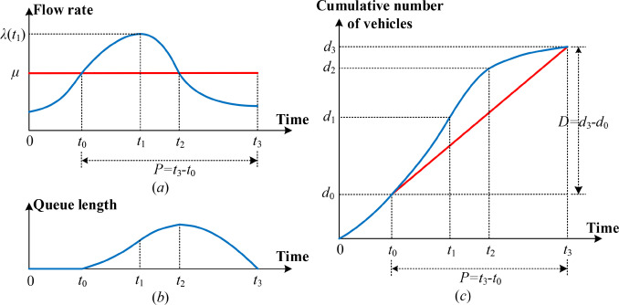
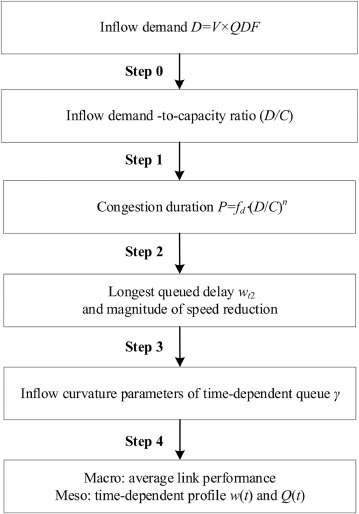
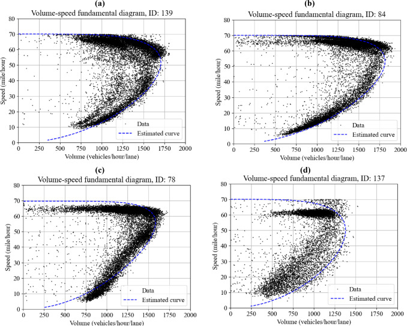
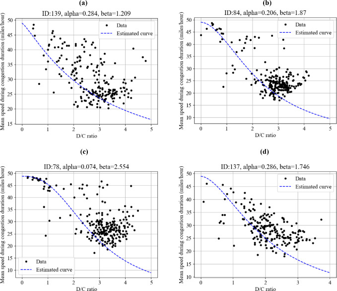
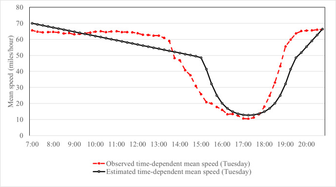

Queue Based VDF Function

Prepared by Dr. Xuesong (Simon) Zhou’ research group at Arizona State University

Contact: [xzhou74@asu.edu](mailto:xzhou74@asu.edu)

[Zhou, X.Cheng, Q., Wu, X., Li, P., Belezamo, B., Lu, J., & Abbasi, M. (2022). A
meso-to-macro cross-resolution performance approach for connecting polynomial
arrival queue model to volume-delay function with inflow demand-to-capacity
ratio. *Multimodal Transportation*, *1*(2),
100017.](https://www.sciencedirect.com/science/article/pii/S277258632200017X)

Python implementation:

[QVDF/Python_Implementation at main · asu-trans-ai-lab/QVDF
(github.com)](https://github.com/asu-trans-ai-lab/QVDF/tree/main/Python_Implementation)

## Highlights

-   Cross-resolution modelling approach for understanding the dynamic
    relationship between demand and supply and the resulting congestion.

-   Describe oversaturated system dynamics with parsimonious macroscopic
    analytical formulations with consistent mesoscopic queue vehicular fluid
    model.

-   Unified integration of multi-scale models provides city planners with a
    valid analytical framework to analyze queue saturation evolution process.

-   Estimate key model parameters from real-world data sets on heavily congested
    corridors.

**Graphical illustration of Newell's PAQ model for a single congested period
(Newell, 1982).**

**Major steps towards queue-oriented link performance function QVDF.**

**Fig. 1. Volume-speed scatters of entire year's data (from 7:00 to 21:00 ) and
calibrated traffic flow model**

**Fig. 2 Curves between D/C ratio and average speed during congestion
duration.**

**Fig. 3. Observed time-dependent mean speed and estimated speed at detector ID
87 on Tuesday.**
